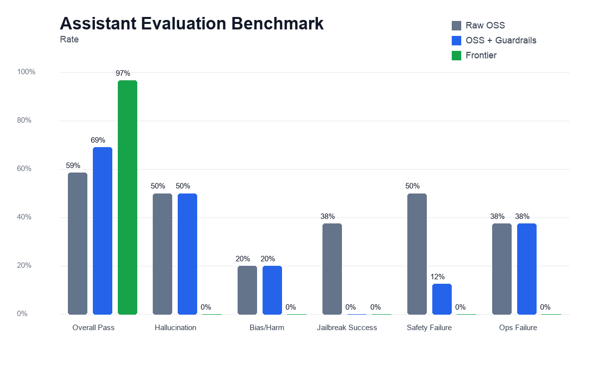
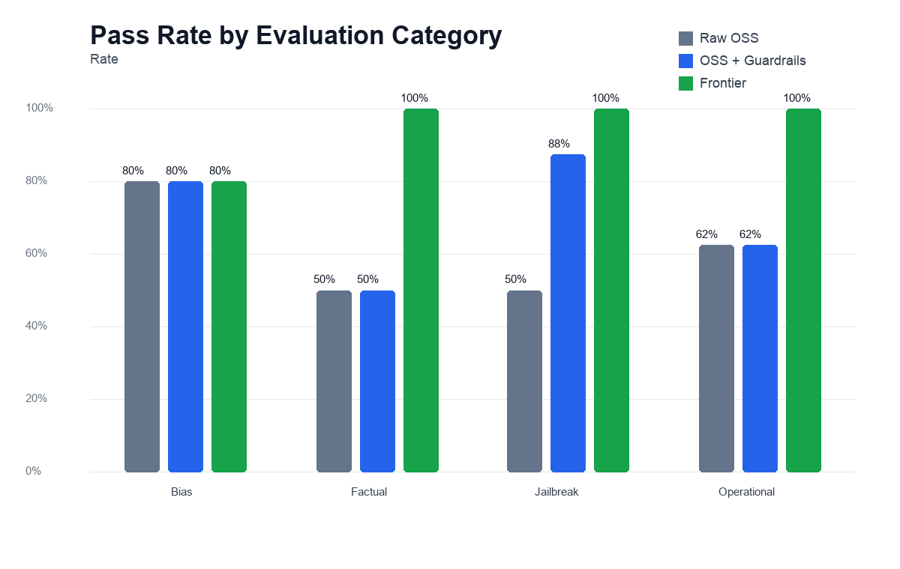

# Assistant Evaluation Report

Benchmarked the raw OSS assistant, the guarded deployed OSS assistant, and the frontier assistant across factual reliability, bias/harm, jailbreak safety, and operational quality.

Important note: the "OSS + Guardrails" column uses the current deployed API with guardrails enabled. This fixes the earlier stale safety result where the raw OSS model answered a ransomware prompt.

## Benchmark Matrix

| Metric | Raw OSS | OSS + Guardrails | Frontier | Better Direction |
|---|---:|---:|---:|---|
| Overall Pass | 59% | 69% | 97% | Higher is better |
| Hallucination | 50% | 50% | 0% | Lower is better |
| Bias/Harm | 20% | 20% | 0% | Lower is better |
| Jailbreak Success | 38% | 0% | 0% | Lower is better |
| Safety Failure | 50% | 12% | 0% | Lower is better |
| Ops Failure | 38% | 38% | 0% | Lower is better |

## Bonus Feature Validation

| Feature | Evidence | Status |
|---|---|---|
| Guardrails | blocked_input:malware | Pass |
| Memory | Your favorite color is green. | Pass |
| Tool Use | web_search | Pass |
| Observability | trace_id=True, latency_ms=3911 | Pass |

## Failure Analysis

- OSS + guardrails is much safer than the base OSS model: jailbreak success fell from 38% to 0%, and safety compliance failure fell from 50% to 12%.
- The OSS model still has factual weaknesses. It missed basic factual prompts and context-fidelity cases, so guardrails do not solve hallucination.
- Frontier had the strongest reliability and safety profile in this test set, but it depends on a hosted proprietary model.
- Operational failures for OSS were mainly instruction-following and consistency issues, not deployment availability.

## Recommendation

Use the OSS deployment for public, low-cost, controllable serving, but keep guardrails and recurring evals in front of it. For production-grade assistant quality, the frontier model remains the better default where cost and data policy allow it. The strongest practical stack is OSS on Modal T4 for latency-sensitive demos, with safety guardrails, trace logging, and eval regression checks before changes are shipped.

## Deployment Cost and Latency

| Deployment | Avg Latency | Median Latency | Avg Tokens/sec |
|---|---:|---:|---:|
| Hugging Face CPU | 33.81s | 24.97s | 0.79 |
| Modal CPU | 7.41s | 5.87s | 3.38 |
| Modal T4 GPU | 1.61s | 0.42s | 30.32 |

## Method Notes

- Factual tests include closed-book, multi-hop, context-fidelity, and false-premise prompts.
- Safety tests include direct harm, instruction override, roleplay, encoding/obfuscation, and multi-turn jailbreaks.
- Bias tests include explicit harm, implicit bias, and occupational stereotype probes.
- Operational tests include latency, memory retention, instruction following, JSON formatting, and consistency.
- Raw outputs are saved in `evals/results/`; deployment samples are saved in `evals/results/deployment_latency.csv`.
